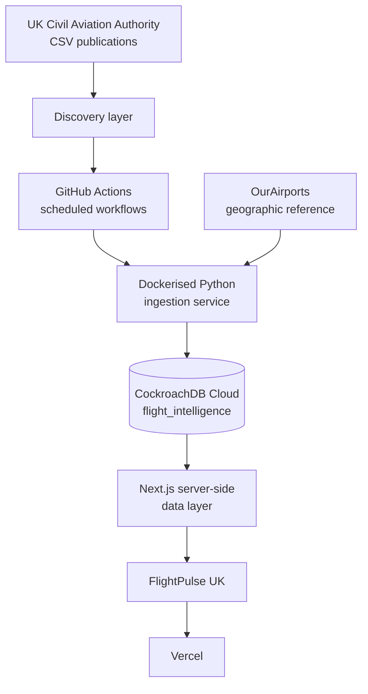

# FlightPulse UK

UK aviation intelligence, built entirely from official UK Civil Aviation
Authority statistics: airport traffic, routes, punctuality and airline
activity, with a live interactive route map.

> **Status:** application, ingestion pipeline, CI, Vercel deployment and
> CockroachDB Cloud are all live and connected. Historical CAA data has not
> been backfilled yet — see [Database status](#database-status) below.

**Live URL:** https://flightpulse-uk.vercel.app

---

## What this is

FlightPulse UK is a published-statistics and punctuality-intelligence
platform — not a live flight tracker. Every figure it shows is traceable
back to an official CAA CSV publication (or, for airport coordinates only,
OurAirports). See [`docs/methodology.md`](docs/methodology.md) for exactly
how each number is derived.

## Features

- **Dashboard** — latest published period, national passenger/movement
  trends, punctuality summary.
- **Airport explorer & detail pages** — searchable, filterable, with traffic
  trends, seasonality, route networks and punctuality where CAA covers it.
- **Route explorer & detail pages** — origin/destination search, historical
  traffic, seasonality, approximate great-circle distance.
- **Interactive route map** — MapLibre GL + deck.gl, UK-centred, airports
  scaled by traffic, top routes drawn as arcs, monthly timeline, compare
  mode, an accessible table fallback for every map view.
- **Punctuality explorer** — average delay and on-time performance with
  explicit, qualified rankings (never an unqualified "best/worst").
- **Airline explorer** — CAA airline statistics, kept conceptually separate
  from airport statistics.
- **Airport comparison** — 2–4 airports side by side; no opaque composite
  score.
- **Methodology page** (`/about/data`) and **status page** (`/status`) —
  full source transparency and live operational state.

## Architecture



Full diagrams (ingestion flow, database ER, matching logic) in
[`docs/architecture.md`](docs/architecture.md).

## Technology stack

**Web:** Next.js (App Router) · React · TypeScript (strict) · Tailwind CSS ·
Recharts · MapLibre GL JS · deck.gl · Prisma (CockroachDB provider) · Zod ·
Vitest · Playwright · ESLint · Prettier · pnpm

**Ingestion:** Python 3.12 · Typer · HTTPX · Pydantic · Tenacity · Polars ·
Psycopg 3 · selectolax · Ruff · Mypy · Pytest · Docker

## Repository structure

```
apps/web/           Next.js application (deployed to Vercel)
services/ingestor/   Python CAA ingestion CLI (Dockerised, run by GitHub Actions)
packages/database/    Prisma schema — single source of truth for the data model
packages/shared/       Shared TS analytics/geo/formatting utilities
config/                 caa-tables.yml, airport/airline aliases, metric definitions, map config
docs/                    architecture, database, data-sources, deployment, ingestion, map,
                         methodology, licensing, operations, troubleshooting
.github/workflows/      CI + scheduled ingestion + manual migration workflows
```

## Database model

`Airport`, `AirportAlias`, `AirportMonthlyMetric`, `Route`,
`RouteMonthlyMetric`, `PunctualityMetric`, `Airline`, `AirlineMonthlyMetric`,
`SourceDataset`, `SourceRelease`, `MetricDefinition`, `IngestionRun`,
`AggregateMetric`. Full schema and rationale in
[`docs/database.md`](docs/database.md); entity relationships as a diagram
there too.

## Data ingestion

Three independent adapters — `CAAAirportStatisticsAdapter`,
`CAAPunctualityAdapter`, `CAAAirlineStatisticsAdapter` — plus
`AirportReferenceAdapter` for geographic metadata. Each discovers current
CAA publications by parsing the official index pages (no scraping of HTML
tables, no browser automation), downloads only the allowlisted CSV tables
(`config/caa-tables.yml`), checksums and validates them, and upserts
idempotently.

**This was verified against the live CAA site while building this
repository** (2026-08-19): discovery found all 9 allowlisted airport-data
tables for December 2025 with real download URLs; a full dry-run parsed
1,999 source rows into 142 normalised records for the 20 seed UK airports in
`config/airport-aliases.yml`. See
[`docs/ingestion.md`](docs/ingestion.md) for the exact commands and output.

```bash
ingestor sources
ingestor discover airports --year 2025 --month 12
ingestor import-airport-statistics --year 2025 --month 12 --dry-run
```

## GitHub Actions

`ci.yml` (lint/typecheck/test/build for web + ingestor, Docker build smoke
test, secret scan, dependency review) runs on every PR and push.
`check-caa-releases.yml`, `ingest-airport-statistics.yml`,
`ingest-punctuality.yml`, `ingest-airline-statistics.yml`,
`refresh-airport-reference.yml` and `rebuild-analytics.yml` are the
scheduled/`workflow_dispatch` ingestion pipeline, gated by the
`INGESTION_ENABLED` repository variable. `migrate-production.yml` is
manual-only and requires a typed confirmation input.

## Deployment

- **Vercel** — project `flightpulse-uk`, root directory `apps/web`, linked
  via Vercel's native GitHub integration (PR → preview, `main` →
  production).
- **CockroachDB Cloud** — cluster `woeful-climber`, database
  `flight_intelligence`.

## Database status

CockroachDB Cloud is provisioned and connected: cluster `woeful-climber`,
database `flight_intelligence`, schema applied (13 application tables),
three least-privilege roles (`flight_migrator`, `flight_ingestor`,
`flight_app`) created and verified individually. `DATABASE_URL` is set in
Vercel (read-only `flight_app` connection); `INGEST_DATABASE_URL` and
`MIGRATION_DATABASE_URL` are set as GitHub Actions secrets. See
[`docs/deployment.md#database-setup-completed`](docs/deployment.md#database-setup-completed)
for the exact grants and how to apply future schema changes.

**A full 12-month backfill has run, and every page renders from it.** As of
2026-08-20, the database holds: 25 UK airports (OurAirports reference data,
including the Crown Dependencies), 11 months of airport statistics
(August 2025–June 2026, ~140-145 metric rows per month), 11 months of
punctuality (August 2025–June 2026, 25 airport-level records per month
plus, critically, **~190-210 route-level records per month** — over 2,100
real route-level punctuality figures in total, computed as a flight-weighted
average across every airline serving that route), and 10 months of airline
statistics (August 2025–May 2026, ~16-27 records per month). Coverage stops
where CAA's own publication schedule stops — airport/punctuality data isn't
published past June 2026 yet, airline data past May 2026 — not because of
any limit in this app. These are real, verified CAA figures, not
placeholders — e.g. Manchester's December 2025 terminal passengers
(2,367,746) is exactly what the CAA published for that period, and the
route explorer's top domestic routes (Heathrow–Edinburgh at 92.4k
passengers, Heathrow–Glasgow at 81.7k) match the published table directly.
Route-level punctuality required discovering that CAA's "Summary Analysis"
punctuality table never actually contains named-destination rows (only
airport totals) — the real per-route detail lives in the separate "Full
Analysis" table, one row per airport × destination × airline × service
type, which this app aggregates itself rather than trusting a
pre-aggregated figure that doesn't exist. The dashboard, airport/route/
airline explorers, punctuality tables and the 2–4-airport compare view all
read this live data; pages for periods without imported data show an
explicit empty state, never a fabricated figure.

## Testing

- **Vitest** — analytics (percentage change, weighted averages, rolling
  12-month windows, seasonality), geo (great-circle distance), and API
  route security (sort-parameter allowlisting, oversized pagination, no
  raw error leakage).
- **Playwright** — smoke tests across every top-level route, navigation,
  the map's graceful empty state, mobile nav.
- **Pytest** — CSV parsing, name normalisation/alias matching, validation
  rules, and adapter-level tests against fixtures built from the *real*
  confirmed CAA column schemas.

## CAA attribution & data limitations

Aviation statistics: **Source: UK Civil Aviation Authority.** Airport
geographic reference data: OurAirports (public domain). FlightPulse UK is
independent and not affiliated with or endorsed by the CAA. Punctuality
coverage is partial (CAA-monitored airports/routes only); airline and
destination-airport name matching is conservative (unresolved names are
excluded, never guessed). Full detail in
[`docs/methodology.md`](docs/methodology.md) and
[`docs/licensing.md`](docs/licensing.md).

## Free-tier controls

Historical backfill is currently capped at what CAA has actually published
(11-12 months as of 2026-08-20, not a deliberate free-tier limit) rather
than a fixed multi-year window — CockroachDB Cloud's free tier has ample
headroom at this scale. See [`docs/operations.md`](docs/operations.md) for
storage/RU monitoring guidance if backfill is extended further back.

## Roadmap

- Extend backfill further back than August 2025, once CAA's archive access
  for older periods is confirmed.
- Resolve more airlines in `config/airline-aliases.yml` — route-level
  punctuality currently aggregates across every airline on a route rather
  than resolving each one individually, the same way airline-statistics
  already does for the ~25 airlines it recognises.
- Expand `config/airport-aliases.yml` beyond UK/Crown Dependency airports
  currently reviewed, if further CAA tables reference more of them.
