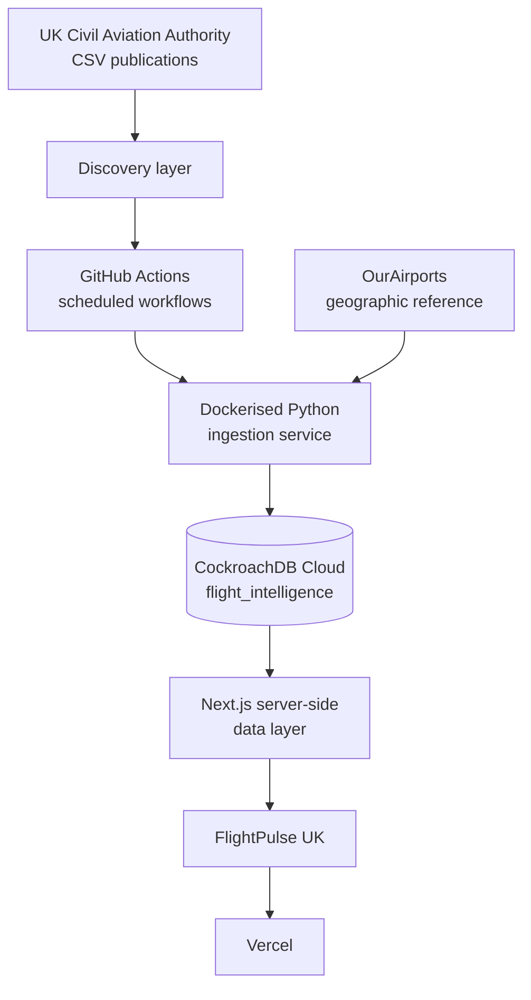

# FlightPulse UK

UK aviation intelligence, built entirely from official UK Civil Aviation
Authority statistics: airport traffic, routes, punctuality and airline
activity, with a live interactive route map.

> **Status:** application, ingestion pipeline, CI and Vercel deployment are
> live. CockroachDB Cloud provisioning is a deliberately deferred step —
> see [Database status](#database-status) below.

**Live URL:** _added after production deployment — see [Deployment](#deployment)_

---

## What this is

FlightPulse UK is a published-statistics and punctuality-intelligence
platform — not a live flight tracker. Every figure it shows is traceable
back to an official CAA CSV publication (or, for airport coordinates only,
OurAirports). See [`docs/methodology.md`](docs/methodology.md) for exactly
how each number is derived.

## Features

- **Dashboard** — latest published period, national passenger/movement
  trends, punctuality summary.
- **Airport explorer & detail pages** — searchable, filterable, with traffic
  trends, seasonality, route networks and punctuality where CAA covers it.
- **Route explorer & detail pages** — origin/destination search, historical
  traffic, seasonality, approximate great-circle distance.
- **Interactive route map** — MapLibre GL + deck.gl, UK-centred, airports
  scaled by traffic, top routes drawn as arcs, monthly timeline, compare
  mode, an accessible table fallback for every map view.
- **Punctuality explorer** — average delay and on-time performance with
  explicit, qualified rankings (never an unqualified "best/worst").
- **Airline explorer** — CAA airline statistics, kept conceptually separate
  from airport statistics.
- **Airport comparison** — 2–4 airports side by side; no opaque composite
  score.
- **Methodology page** (`/about/data`) and **status page** (`/status`) —
  full source transparency and live operational state.

## Architecture



Full diagrams (ingestion flow, database ER, matching logic) in
[`docs/architecture.md`](docs/architecture.md).

## Technology stack

**Web:** Next.js (App Router) · React · TypeScript (strict) · Tailwind CSS ·
Recharts · MapLibre GL JS · deck.gl · Prisma (CockroachDB provider) · Zod ·
Vitest · Playwright · ESLint · Prettier · pnpm

**Ingestion:** Python 3.12 · Typer · HTTPX · Pydantic · Tenacity · Polars ·
Psycopg 3 · selectolax · Ruff · Mypy · Pytest · Docker

## Repository structure

```
apps/web/           Next.js application (deployed to Vercel)
services/ingestor/   Python CAA ingestion CLI (Dockerised, run by GitHub Actions)
packages/database/    Prisma schema — single source of truth for the data model
packages/shared/       Shared TS analytics/geo/formatting utilities
config/                 caa-tables.yml, airport/airline aliases, metric definitions, map config
docs/                    architecture, database, data-sources, deployment, ingestion, map,
                         methodology, licensing, operations, troubleshooting
.github/workflows/      CI + scheduled ingestion + manual migration workflows
```

## Database model

`Airport`, `AirportAlias`, `AirportMonthlyMetric`, `Route`,
`RouteMonthlyMetric`, `PunctualityMetric`, `Airline`, `AirlineMonthlyMetric`,
`SourceDataset`, `SourceRelease`, `MetricDefinition`, `IngestionRun`,
`AggregateMetric`. Full schema and rationale in
[`docs/database.md`](docs/database.md); entity relationships as a diagram
there too.

## Data ingestion

Three independent adapters — `CAAAirportStatisticsAdapter`,
`CAAPunctualityAdapter`, `CAAAirlineStatisticsAdapter` — plus
`AirportReferenceAdapter` for geographic metadata. Each discovers current
CAA publications by parsing the official index pages (no scraping of HTML
tables, no browser automation), downloads only the allowlisted CSV tables
(`config/caa-tables.yml`), checksums and validates them, and upserts
idempotently.

**This was verified against the live CAA site while building this
repository** (2026-08-19): discovery found all 9 allowlisted airport-data
tables for December 2025 with real download URLs; a full dry-run parsed
1,999 source rows into 142 normalised records for the 20 seed UK airports in
`config/airport-aliases.yml`. See
[`docs/ingestion.md`](docs/ingestion.md) for the exact commands and output.

```bash
ingestor sources
ingestor discover airports --year 2025 --month 12
ingestor import-airport-statistics --year 2025 --month 12 --dry-run
```

## GitHub Actions

`ci.yml` (lint/typecheck/test/build for web + ingestor, Docker build smoke
test, secret scan, dependency review) runs on every PR and push.
`check-caa-releases.yml`, `ingest-airport-statistics.yml`,
`ingest-punctuality.yml`, `ingest-airline-statistics.yml`,
`refresh-airport-reference.yml` and `rebuild-analytics.yml` are the
scheduled/`workflow_dispatch` ingestion pipeline, gated by the
`INGESTION_ENABLED` repository variable. `migrate-production.yml` is
manual-only and requires a typed confirmation input.

## Deployment

- **Vercel** — project `flightpulse-uk`, root directory `apps/web`, linked
  via Vercel's native GitHub integration (PR → preview, `main` →
  production).
- **CockroachDB Cloud** — cluster `safe-hippo`, database
  `flight_intelligence`.

## Database status

CockroachDB Cloud provisioning was **intentionally deferred** — at the
project owner's request, everything else was built and verified first, and
the database step happens when they return with the cluster's admin
connection string. Until then:

- Every page and API route renders correctly and shows an explicit
  "Database connection not yet configured" state rather than fabricated
  data (see `lib/db.ts` — `withDatabase()`).
- `prisma generate`, the full Next.js production build, all unit/e2e tests,
  and the Docker ingestion image all run and pass without a live database.
- The exact remaining steps (create database, least-privilege roles, apply
  migrations, set secrets, run the calibration import) are documented in
  [`docs/deployment.md#deferred-database-setup`](docs/deployment.md#deferred-database-setup).

## Testing

- **Vitest** — analytics (percentage change, weighted averages, rolling
  12-month windows, seasonality), geo (great-circle distance), and API
  route security (sort-parameter allowlisting, oversized pagination, no
  raw error leakage).
- **Playwright** — smoke tests across every top-level route, navigation,
  the map's graceful empty state, mobile nav.
- **Pytest** — CSV parsing, name normalisation/alias matching, validation
  rules, and adapter-level tests against fixtures built from the *real*
  confirmed CAA column schemas.

## CAA attribution & data limitations

Aviation statistics: **Source: UK Civil Aviation Authority.** Airport
geographic reference data: OurAirports (public domain). FlightPulse UK is
independent and not affiliated with or endorsed by the CAA. Punctuality
coverage is partial (CAA-monitored airports/routes only); airline and
destination-airport name matching is conservative (unresolved names are
excluded, never guessed). Full detail in
[`docs/methodology.md`](docs/methodology.md) and
[`docs/licensing.md`](docs/licensing.md).

## Free-tier controls

Historical scope is intentionally bounded at launch (five years of
monthly airport/punctuality data, three years of airline data), and a
calibration import (one month per family) is required before any larger
backfill — see [`docs/operations.md`](docs/operations.md) and section 79 of
the original build brief.

## Roadmap

- Complete CockroachDB Cloud provisioning and the calibration import.
- Wire the ingestor's database-write path (`database/upserts.py`) into the
  CLI's persist step.
- Expand `config/airport-aliases.yml` and `config/airline-aliases.yml`
  beyond the reviewed seed set.
- Parse the CAA "Full Analysis" punctuality tables for airline/direction
  level detail.
- Historical backfill, once calibration confirms storage/RU projections.
