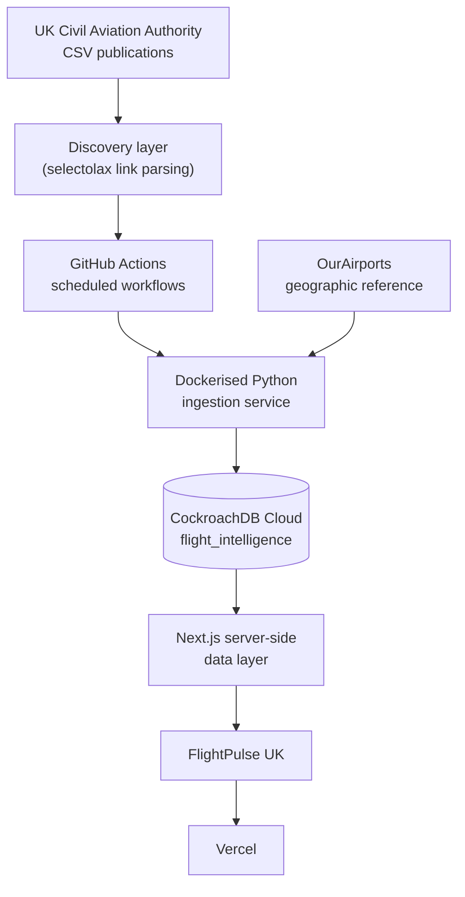
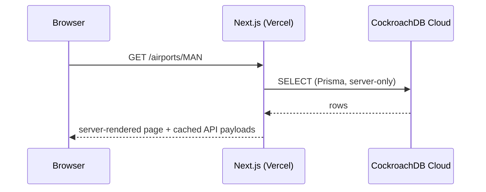

# Architecture

FlightPulse UK is a monorepo with three deployable units and one shared
config/data layer:

- **apps/web** — Next.js App Router application, deployed to Vercel.
- **services/ingestor** — Dockerised Python CLI that discovers, downloads
  and normalises CAA CSV publications, run on a schedule by GitHub Actions
  (never on a developer's machine in production).
- **packages/database** — the single Prisma schema (CockroachDB provider)
  shared as the source of truth for both the web app's read queries and the
  ingestor's understanding of the target tables.
- **config/** — version-controlled facts (which CAA tables are imported,
  airport/airline name mappings, metric definitions, map defaults) that both
  the ingestor and the web app read, so a mapping change is a reviewable
  pull request, not a silent runtime decision.

## Cloud architecture

No step in this diagram requires a developer machine to stay on. GitHub
Actions runners execute the ingestion container on a schedule; Vercel builds
and serves the web app from the GitHub repository.

## Why a monorepo

The Prisma schema is the contract between the ingestor (which writes) and
the web app (which reads). Keeping them in one repository means a schema
change and the code that depends on it land in the same pull request and the
same CI run, rather than needing to be coordinated across repositories.

## Request path (production)

`DATABASE_URL` never reaches the browser — see docs/deployment.md and
docs/operations.md#secret-handling.

## Database provisioning

CockroachDB Cloud (cluster `woeful-climber`, database
`flight_intelligence`) is provisioned and connected — see
docs/deployment.md#database-setup-completed for the roles, grants, and
schema-application approach. No historical CAA data has been backfilled
yet; that's a deliberate next step (see docs/ingestion.md).
