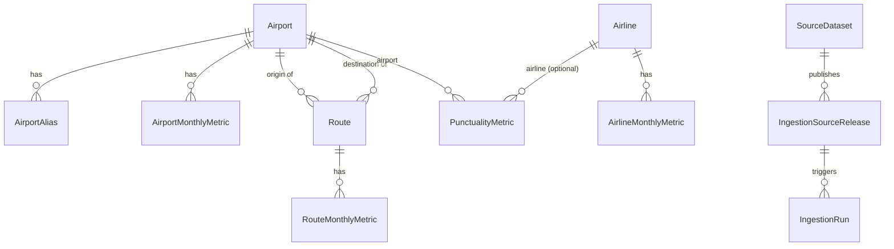

# Database

Schema: `packages/database/prisma/schema.prisma`, provider `cockroachdb`.
See docs/deployment.md for why the live database itself is a deferred step.

## Entity relationships

## Design notes

- **IATA/ICAO are optional** on `Airport` — not every reporting airport has
  both, and some (military, small GA fields in the OurAirports feed) have
  neither. `canonicalCode` is the one mandatory, internally generated
  identifier.
- **AirportMonthlyMetric / AirlineMonthlyMetric use a metric-code + value
  pattern** rather than one column per metric. This was chosen over
  dedicated numeric columns because the metric set is still growing
  (section 33 of the build brief permits switching to dedicated columns
  later "based on measured query patterns" — no such measurement exists
  yet on an empty database, so the flexible schema is the conservative
  starting point).
- **Route is airport-pair identity; RouteMonthlyMetric is the observation.**
  This split exists so a route's identity (and its `distance_km`) doesn't
  need to be recomputed every month. See docs/methodology.md for the
  domestic-pair directionality rule.
- **PunctualityMetric.destinationAirportId is nullable** — an airport-level
  row (CAA's "AIRPORT TOTAL" sentinel) has no destination; a route-level row
  does.
- **Every fact table carries `sourceDatasetId` + `sourceReleaseId`** so a
  revised CAA publication can be traced back to exactly which download
  produced which row, and so revisions can be reimported idempotently (see
  docs/ingestion.md).
- **AggregateMetric** exists for precomputed dashboard/ranking values.
  Section 43 of the build brief is explicit: "do not precompute every
  possible filter combination" — only the specific views the dashboard and
  ranking pages need.

## Indexes

Starting set (see schema for exact `@@index`/`@@unique` declarations):
`Airport.iataCode`/`icaoCode` (unique), `Airport.normalisedName`,
`AirportMonthlyMetric(airportId, year, month, metricCode)` (unique),
`Route(originAirportId, destinationAirportId)` (unique),
`RouteMonthlyMetric(routeId, year, month)` (unique),
`PunctualityMetric(year, month)` / `(airportId)` / `(destinationAirportId)`
/ `(airlineId)`, `SourceRelease(sourceDatasetId, year, month, checksum)`
(unique — this is what makes reimporting an unchanged file a no-op).

Per section 64 of the build brief, no further secondary indexes should be
added until `EXPLAIN` on real production queries justifies them — see
docs/operations.md#checking-cockroachdb-storage-and-ru-use once the
database is live.

## Least-privilege roles (planned, not yet created)

Three SQL roles are planned for when CockroachDB Cloud is provisioned —
`flight_app` (read-only, used by the Vercel app), `flight_ingestor`
(insert/update on aviation + ingestion tables only), and `flight_migrator`
(schema migrations only, never configured in the Vercel app). See
docs/deployment.md#deferred-database-setup and docs/operations.md for the
exact commands to run when the admin connection string is available.
