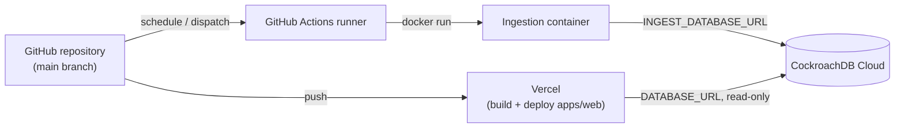

# Deployment

## Components and where they run

| Component | Runs on | Trigger |
|---|---|---|
| Web app | Vercel | Git push (preview on PR, production on `main`) |
| Ingestion | GitHub Actions (Docker) | Schedule + `workflow_dispatch` |
| Migrations | GitHub Actions (`migrate-production.yml`) | Manual `workflow_dispatch` only |
| Database | CockroachDB Cloud (`woeful-climber` cluster) | Always-on managed service |

Nothing requires a developer's machine to stay on after the initial setup
described here.

## Database setup (completed)

CockroachDB Cloud is provisioned: cluster `woeful-climber`, database
`flight_intelligence`, with three least-privilege roles created via the SQL
below (see `packages/database/prisma/migrations/` for the applied baseline
schema — 13 application tables plus Prisma's migration-history table).

- `flight_migrator` — `GRANT ALL ON DATABASE flight_intelligence` — used only
  by the manual `migrate-production.yml` workflow, never configured in the
  Vercel app.
- `flight_ingestor` — `SELECT, INSERT, UPDATE, DELETE` on tables (and
  `USAGE, SELECT` on sequences) via `ALTER DEFAULT PRIVILEGES FOR ROLE
  flight_migrator`, so it automatically covers tables created by future
  migrations too — used by the ingestion service.
- `flight_app` — `SELECT` only, via the same default-privilege mechanism —
  used by the deployed web app.

Verified live: `SHOW GRANTS ON TABLE airports` confirms exactly this split,
and `/api/status` on production reports `databaseConfigured: true`.

Connection strings are stored only in their target secret store — never in
the repository:

- `INGEST_DATABASE_URL`, `MIGRATION_DATABASE_URL` → GitHub Actions secrets
  (`gh secret list --repo ynot-tony1/flightpulse-uk`).
- `DATABASE_URL` (the app's read-only connection, via `flight_app`) →
  Vercel project environment variables (production/preview/development).

For local development, copy `.env.example` to `.env` (gitignored) and fill
in real values there — never in `.env.example` itself, which is committed.

### Applying future schema changes

The baseline schema was applied directly via a generated SQL diff
(`prisma migrate diff --from-empty ... --script`) rather than `prisma db
push`, because CockroachDB Serverless auto-creates a `crdb_internal_region`
enum on `CREATE DATABASE` that `db push`'s full-database diff tries (and
fails) to drop. For incremental changes going forward, generate a normal
migration locally (`prisma migrate dev`) against a scratch database, commit
the resulting `prisma/migrations/<timestamp>_<name>/migration.sql`, and
apply it in production via the `migrate-production.yml` workflow
(`prisma migrate deploy` — never `migrate reset`).

### Calibration import

Historical backfill has not started yet — see docs/ingestion.md "Next
steps" and section 79 of the build brief. Run one month per data family
first and measure storage/RU before importing years of history.

## Vercel

- Project name: `flightpulse-uk`, root directory `apps/web` (set via
  `vercel project update flightpulse-uk --root-directory apps/web`).
- Non-sensitive env vars (`NEXT_PUBLIC_*`, `MAP_MAX_ROUTES`,
  `API_CACHE_TTL_SECONDS`, `LOG_LEVEL`) are set across production, preview
  and development; see `.env.example`. `DATABASE_URL` is deferred — see
  above — and will be added as a sensitive/encrypted Vercel env var, never
  prefixed `NEXT_PUBLIC_`.
- Both a preview and a production deployment were built and verified live
  via the Vercel CLI (`vercel deploy` / `vercel deploy --prod`) — every
  top-level route returns HTTP 200. Production: https://flightpulse-uk.vercel.app

### Outstanding manual step: GitHub auto-deploy

`vercel git connect` could not complete non-interactively — connecting a
Vercel project to a GitHub repository requires the Vercel GitHub App to be
installed/authorized for the account via the browser, which a CLI session
cannot do. Until that one-time step is done, `main`/PR pushes will **not**
automatically trigger a new Vercel deployment; use `vercel deploy` /
`vercel deploy --prod` from the repository root (with `.vercel/project.json`
linked) to deploy manually. To enable automatic deploys:

1. Open the project in the Vercel dashboard → Settings → Git.
2. Click "Connect Git Repository", authorize the Vercel GitHub App for
   `ynot-tony1/flightpulse-uk` if prompted.
3. From then on, PRs get preview deployments and pushes to `main` deploy to
   production automatically, per section 69 of the build brief.

## GitHub Actions

See `.github/workflows/`. `ci.yml` runs on every PR/push (lint, typecheck,
test, build — web and ingestor, plus a Docker build smoke test). The
ingestion workflows (`ingest-*.yml`, `check-caa-releases.yml`,
`refresh-airport-reference.yml`) are schedule + `workflow_dispatch` and gate
on the `INGESTION_ENABLED` repository variable so ingestion can be paused
without editing workflow files. `migrate-production.yml` is
`workflow_dispatch`-only, never scheduled.

See docs/operations.md for the day-to-day commands (redeploy, rollback,
disable ingestion, rotate credentials).
