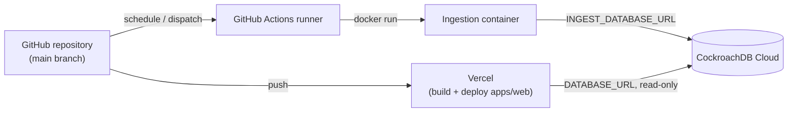

# Deployment

## Components and where they run

| Component | Runs on | Trigger |
|---|---|---|
| Web app | Vercel | Git push (preview on PR, production on `main`) |
| Ingestion | GitHub Actions (Docker) | Schedule + `workflow_dispatch` |
| Migrations | GitHub Actions (`migrate-production.yml`) | Manual `workflow_dispatch` only |
| Database | CockroachDB Cloud (`safe-hippo` cluster) | Always-on managed service |

Nothing requires a developer's machine to stay on after the initial setup
described here.

## Deferred database setup

**As of this build, CockroachDB Cloud provisioning has intentionally not
been performed.** Per the project owner's instruction, everything else was
built first; the database step happens when they return with the cluster's
admin bootstrap connection string. This section is the exact runbook for
that step — follow it in order.

1. Confirm `COCKROACH_BOOTSTRAP_URL` is present in the shell environment
   (`test -n "$COCKROACH_BOOTSTRAP_URL"`) without printing it.
2. Connect and verify: `psql "$COCKROACH_BOOTSTRAP_URL" -c "SELECT 1;"` (or
   `ingestor verify` once `INGEST_DATABASE_URL` is set to the same value
   temporarily) — confirms TLS and cluster reachability without ever
   echoing the URL.
3. Create the database: `CREATE DATABASE IF NOT EXISTS flight_intelligence;`
4. Create three roles with least privilege (see docs/database.md and
   section 66 of the build brief for the exact grants):
   `flight_migrator` (schema changes only), `flight_ingestor` (DML on
   aviation + ingestion tables), `flight_app` (read-only).
5. Generate strong passwords for each role with a password generator —
   never typed or echoed in a terminal that gets logged.
6. Build three connection strings — `MIGRATION_DATABASE_URL`,
   `INGEST_DATABASE_URL`, `DATABASE_URL` (the app's *read-only* URL, despite
   the generic name) — and store each directly in its target secret store:
   - `MIGRATION_DATABASE_URL` and `INGEST_DATABASE_URL` →
     `gh secret set MIGRATION_DATABASE_URL` / `gh secret set INGEST_DATABASE_URL`
     (paste at the interactive prompt, not as a CLI argument).
   - `DATABASE_URL` → `vercel env add DATABASE_URL production` (and
     `preview` if preview deployments should also read live data).
7. From a machine with `MIGRATION_DATABASE_URL` set:
   `pnpm --filter @flightpulse/database migrate:deploy` (wraps
   `prisma migrate deploy` — never `migrate reset` against production, see
   section 78 of the build brief).
8. Run `ingestor verify` (uses `INGEST_DATABASE_URL`) and a Vercel-side
   smoke test (any page that reads from the database) to confirm all three
   roles actually work.
9. `unset COCKROACH_BOOTSTRAP_URL` in the shell once step 6 is done.
10. Run the calibration import (docs/ingestion.md "Next steps",
    section 79 of the build brief) before backfilling years of history.

## Vercel

- Project name: `flightpulse-uk`, root directory `apps/web`.
- Uses Vercel's native GitHub integration (not manual CLI deploys) so that
  every PR gets a preview deployment and `main` deploys to production
  automatically once linked.
- Non-sensitive env vars (`NEXT_PUBLIC_*`, `MAP_MAX_ROUTES`,
  `API_CACHE_TTL_SECONDS`, `LOG_LEVEL`) are safe to set directly; see
  `.env.example`. `DATABASE_URL` is set as a sensitive/encrypted Vercel env
  var and is never prefixed `NEXT_PUBLIC_`.

## GitHub Actions

See `.github/workflows/`. `ci.yml` runs on every PR/push (lint, typecheck,
test, build — web and ingestor, plus a Docker build smoke test). The
ingestion workflows (`ingest-*.yml`, `check-caa-releases.yml`,
`refresh-airport-reference.yml`) are schedule + `workflow_dispatch` and gate
on the `INGESTION_ENABLED` repository variable so ingestion can be paused
without editing workflow files. `migrate-production.yml` is
`workflow_dispatch`-only, never scheduled.

See docs/operations.md for the day-to-day commands (redeploy, rollback,
disable ingestion, rotate credentials).
