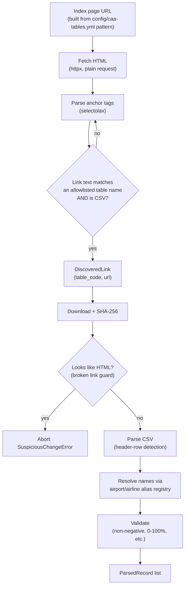

# Ingestion

`services/ingestor` is a Python 3.12 CLI (Typer) packaged as
`flightpulse-ingestor`, run via Docker in GitHub Actions. It has been
exercised against the live CAA site (not just fixtures) as part of building
this repository — see "Verified live run" below.

## Discovery flow



No browser automation is used — CAA publication pages are static
server-rendered HTML (confirmed by fetching them directly with `httpx`).

## Verified live run (2026-08-19)

Running `ingestor discover airports --year 2025 --month 12` against the real
CAA site returned all 9 allowlisted tables with real download URLs.
Downloading and parsing all of them
(`ingestor import-airport-statistics --year 2025 --month 12 --dry-run`)
produced:

```
links_discovered: 9, files_downloaded: 7, rows_seen: 1999,
rows_valid: 127, rows_rejected: 1872, records_parsed: 142
```

The rejection rate is expected, not a bug: `config/airport-aliases.yml`
currently contains 20 manually reviewed UK airports (enough to exercise the
pipeline end-to-end), while the source files list several hundred
domestic/foreign airport names. Every unresolved name is reported by name
(never guessed) — see the CLI's `unresolved_names` output and
docs/methodology.md. Expanding the alias registry is the main remaining
step before a full production import (see "Next steps" below).

## CLI commands

```
ingestor sources                        # list configured datasets
ingestor discover <family> --year --month
ingestor inspect <family> --year --month --table-code   # download + show header/sample row, no import
ingestor import-airport-statistics --year --month [--dry-run]
ingestor import-punctuality --year --month [--dry-run]
ingestor import-airlines --year --month [--dry-run]
ingestor refresh-airport-reference [--dry-run]
ingestor verify                         # SELECT 1, never prints the connection string
ingestor cleanup                        # delete any temp downloaded files
ingestor run --year --month [--dry-run] # all enabled adapters, then cleanup
```

Every `import-*` command respects the `INGESTION_ENABLED` /
`AIRPORT_STATS_ENABLED` / `PUNCTUALITY_STATS_ENABLED` / `AIRLINE_STATS_ENABLED`
environment flags and exits cleanly (not an error) when a family is
disabled.

## Idempotency & revision handling

Every upsert (`database/upserts.py`) targets the same unique constraint used
in the Prisma schema (e.g. `(airportId, year, month, metricCode)`), so
re-running an import with an unchanged file changes nothing. `SourceRelease`
records a SHA-256 checksum per download; a re-check that finds a new
checksum for the same year/month is treated as a revision and reimported —
see docs/methodology.md and section 46 of the build brief.

## Suspicious-change detection

`validation/rules.py` raises `SuspiciousChangeError` (aborting the import,
never overwriting good data) when: a file parses to zero rows, a download
returns an HTML page instead of a CSV, an expected header is missing, or a
total collapses more than the configured threshold versus the last known
import. These are surfaced as GitHub Actions step failures with a summary,
not swallowed.

## Database write path — currently deferred

`database/upserts.py` implements the idempotent upsert SQL, and
`database/connection.py` reads `INGEST_DATABASE_URL` from the environment
and never logs it. The CLI's `_persist_or_warn` step intentionally does not
call the upsert path yet: `INGEST_DATABASE_URL` is unset until CockroachDB
Cloud provisioning (docs/deployment.md#deferred-database-setup) is
complete. Every command that doesn't need the database — `sources`,
`discover`, `inspect`, `import-* --dry-run`, `refresh-airport-reference
--dry-run` — is fully functional today, as demonstrated above.

## Next steps before a full production import

1. Complete CockroachDB Cloud provisioning (docs/deployment.md).
2. Wire `_persist_or_warn` in `cli.py` to actually call the
   `database/upserts.py` functions inside a transaction.
3. Expand `config/airport-aliases.yml` beyond the 20 seed airports (review
   each addition — see docs/methodology.md's conservative-matching rule)
   and, separately, `config/airline-aliases.yml`.
4. Run the calibration import (section 79 of the build brief): one month
   each of airport/punctuality/airline data plus the airport reference
   snapshot, then measure storage/RU before backfilling years of history.
