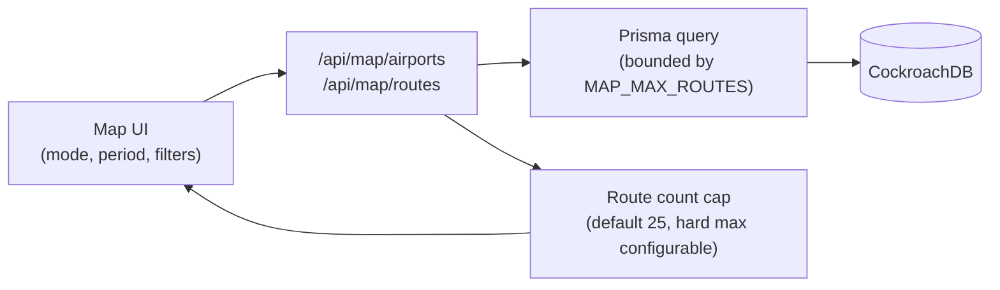

# Interactive map

Route: `/map`. Built with MapLibre GL JS (base map) and deck.gl
(`ArcLayer` for routes, `ScatterplotLayer` for airports), per
`config/map-config.yml`.

## Data flow

The map API never returns the full historical route set — every request
must specify a period, a metric, and gets capped at a maximum route count
(default 25, selectable 10/25/50/100, hard ceiling configurable via
`MAP_MAX_ROUTES`). See docs/architecture.md and section 51 of the build
brief.

## Modes

`PASSENGER_ROUTES`, `AIRPORT_TRAFFIC`, `PUNCTUALITY`, `AVERAGE_DELAY`,
`DOMESTIC`, `INTERNATIONAL`, `FREIGHT`, `GROWTH` — see
`config/map-config.yml`. A mode is disabled in the UI (not silently empty)
if its underlying table has no rows for the selected period.

## Timeline & compare mode

The monthly timeline never autoplays on load and respects
`prefers-reduced-motion` (`config/map-config.yml` →
`timeline.respect_reduced_motion`). Compare mode (e.g. Jan 2019 vs Jan 2026)
shows both absolute and percentage change and refuses to compare periods
that used a different `methodology_version` for the metric in question
without a visible warning (see docs/methodology.md).

## Dark mode

The MapLibre style switches with the site theme
(`NEXT_PUBLIC_MAP_STYLE_URL` — see `.env.example`); charts inherit the same
theme tokens as the rest of the UI.
